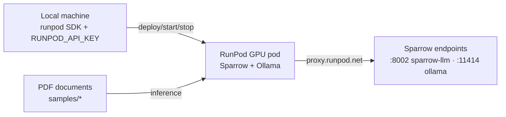

# Sparrow — Serverless OCR on RunPod

[](https://www.runpod.io/)
[](https://www.docker.com/)
[](https://github.com/katanaml/sparrow)

> Deploy and run the [Sparrow](https://github.com/katanaml/sparrow) document-parsing stack as a **serverless GPU endpoint on RunPod**, controlled via the Python SDK.

This project packages **Sparrow** (document OCR/inference: PDFs and images →
structured data, with LLM-assisted extraction) into a portable Docker image and
automates its lifecycle on RunPod GPUs — deploy, start, stop — so you get an
on-demand, pay-per-second OCR API instead of a standing server.

## ✨ Features

- **One-command deployment** — `deploy.py` builds/pushes the image, spins up a GPU pod (with GPU fallback chain: A5000 → 3090 → 4090…), and exposes the Sparrow API
- **On-demand pod management** — `start.py` / `stop.py` resume and pause the pod through the RunPod SDK (cost-capped, no idle GPU billing)
- **Remote smoke tests** — `test_remote_sparrow.sh` runs inference against the live endpoint (Sparrow + Ollama)
- **Samples included** — sample PDF documents shipped under `samples/`

## 🏗️ Architecture



## 🧰 Stack

| Layer | Choice |
|---|---|
| Document parsing | [Sparrow](https://github.com/katanaml/sparrow) (data-extraction API) |
| Cloud GPU | [RunPod](https://www.runpod.io/) — serverless pods, SDK-driven |
| Packaging | Docker (multi-stage, CUDA base) |
| Control plane | Python SDK (`runpod`) — no manual console steps |

## 🚀 Getting Started

**Prerequisites:** `RUNPOD_API_KEY` exported in your environment (from your
[RunPod account](https://www.runpod.io/console)), Docker for local builds.

```bash
# Deploy: build, push and create the GPU pod
python3 deploy.py

# Resume / pause the pod (only pay while running)
python3 start.py
python3 stop.py

# Or use the shell wrappers
./deploy.sh && ./start.sh && ./stop.sh
```

**Test the endpoint:**

```bash
./test_remote_sparrow.sh          # full remote test
cat manual_tests/curl-document-1.txt   # manual curl example (set $POD_ID)
```

## 📦 Repository layout

```
.
├── deploy.py / start.py / stop.py   # pod lifecycle via RunPod SDK
├── Dockerfile                       # Sparrow image (CUDA)
├── test_remote_sparrow.sh           # remote inference tests
├── manual_tests/                    # manual curl test recipes
└── samples/                         # sample PDF documents
```
